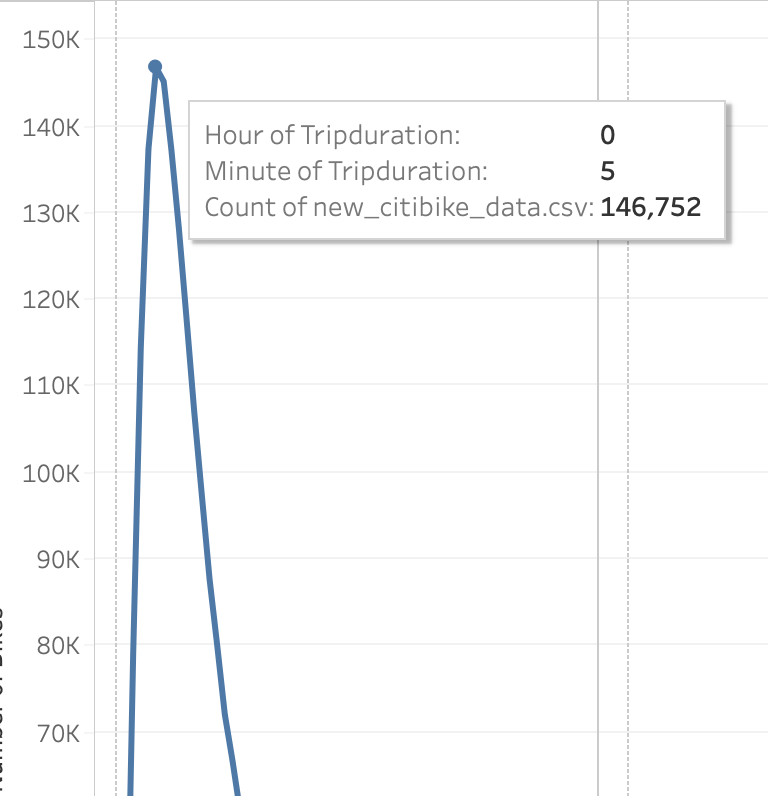
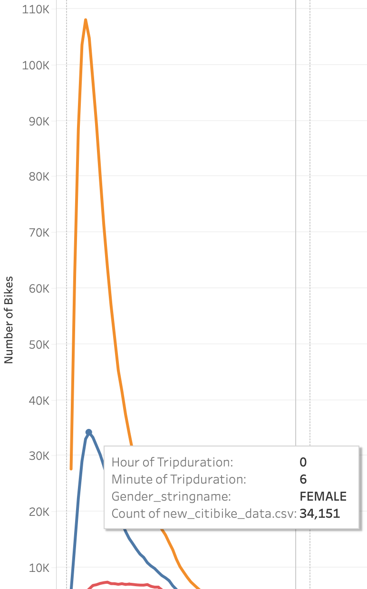
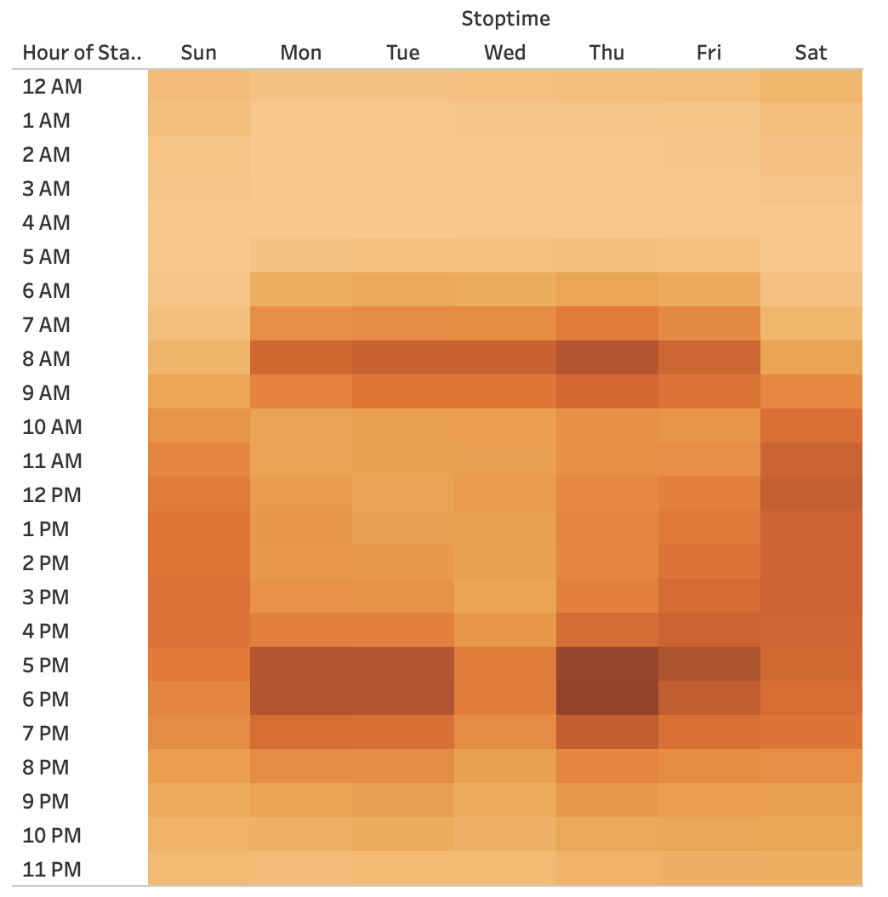
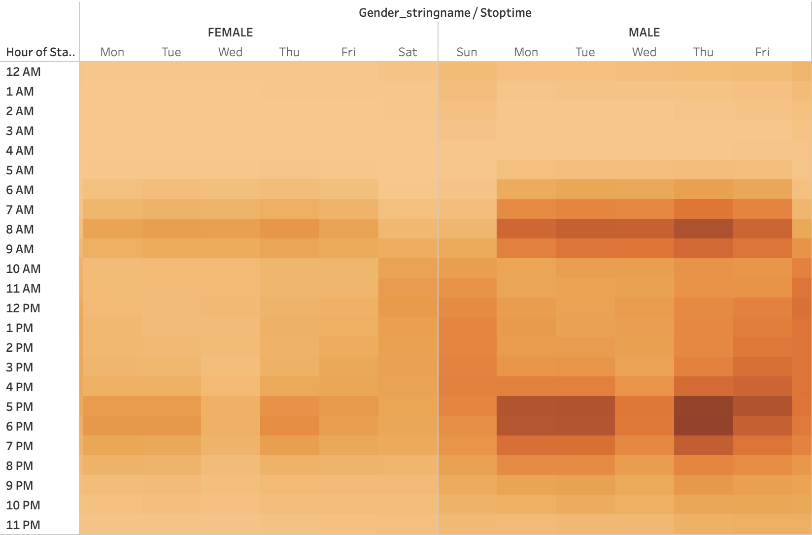
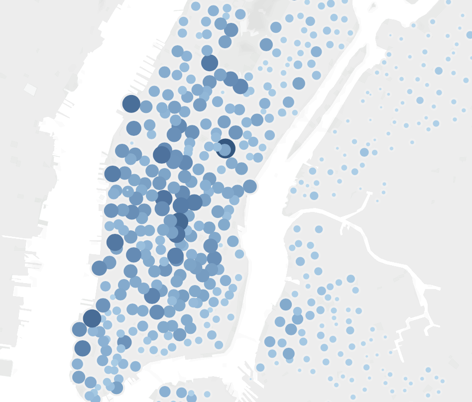
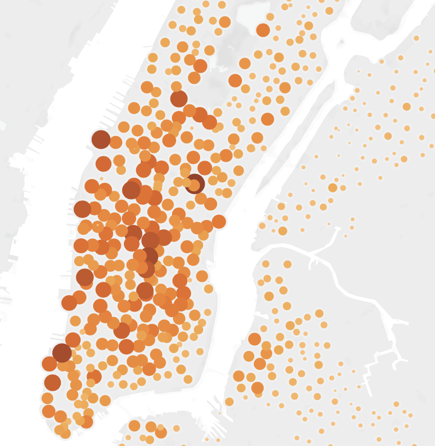

# bikesharing

[Bikesharing_Challenge_Tableau_Link](https://public.tableau.com/app/profile/jose.perez8057/viz/Bikesharing_Challenge_16490425140620/DesMoinesStory?publish=yes) This link will take you to the Tableau Story

[Link_to_bike_data](https://s3.amazonaws.com/tripdata/201908-citibike-tripdata.csv.zip) This link will automatically download the zip file necessary for the analysis

# Overview of Analysis

The purpose of this analysis is to show an investor a bikesharing business proposal in the city of Des Moines, Iowa. Using Citi Bike data from August of 2019, we use Tableau to visualize the data and come up with an analysis and presentation to the investor. For this analysis we are using Tableau Desktop Public Edition.

# Results

### Checkout Times for Users

In the first page of our story, we see that most users spend about 5 minutes on the bike, more than likely to make a quick commute to their destination.

### Checkout Times by Gender

In the second page of our story, we see that most bike users are male. Most male users spend about 5 minutes on the bike, and most women spend about 6 minutes on the bike. Those who didn't specify their gender had a variety of trip durations.

### Trips by Weekday per Hour

In the third page of our story, we see that most rides happen between 6AM - 9AM and 4PM - 8PM. This is because most bike users use bikes to commute to work.

### Trips by Weekday by Gender

In the fourth page of our story, we see that males use the bikes more than females, however the data still shows that bikes are heavily used for work commute.

### User Trip by Gender by Weekday

In the fifth page of our analysis, we see that our gender analysis is still true, however we see that most of our users are subscribers.

### Top Starting Locations

In the sixth page of our story, we see that bikes are heavily picked up in downtown and midtown Manhattan. Most corporate offices are located in Manhattan, so this backs up our theory that bikes are being used to commute to work.

### Top Ending Locations

In the seventh page of our story, we see that bikes are heavily left in downtown and midtown Manhattan. This shows that the same bike is rotated and used around the same area for work commutes.

# Summary

Two additional visualizations I would add to the story is:

1. See how close bikes are located near subway entrances. If bikes are used for about 5 minutes, then it feels like user's main source of transportation is subways, and bikes are used instead of walking.

2. Where are the bikes being dropped off. If multiple people are using bikes to commute to the same work location, then maybe Citibike should work with businesses to add discounts to subscriptions to increase subscribers.